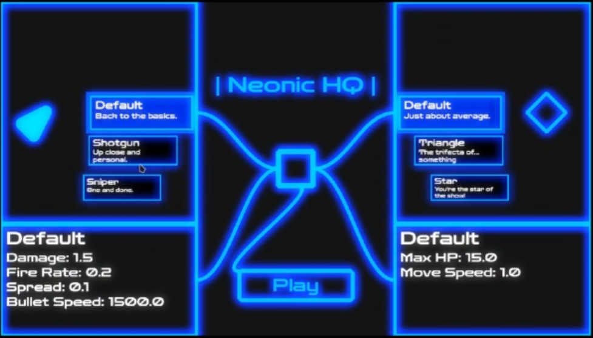
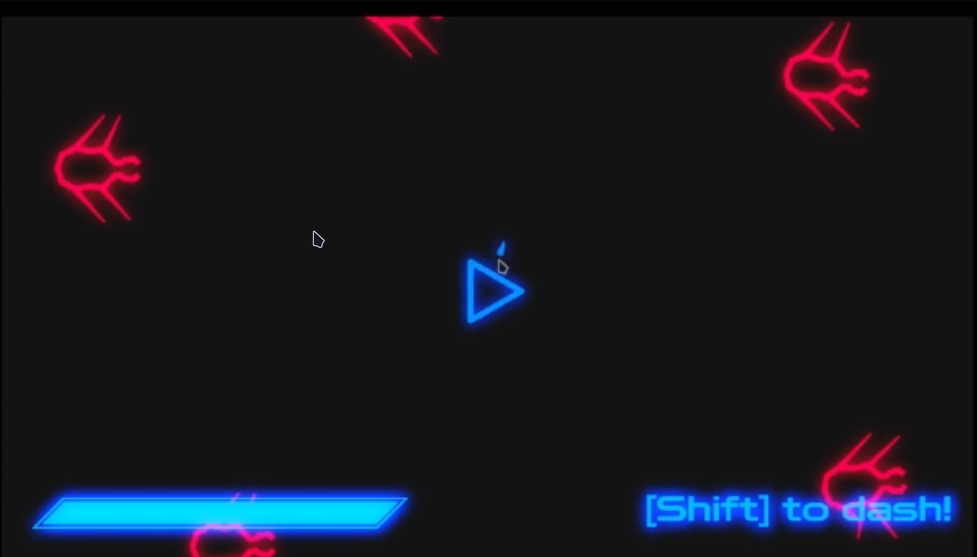
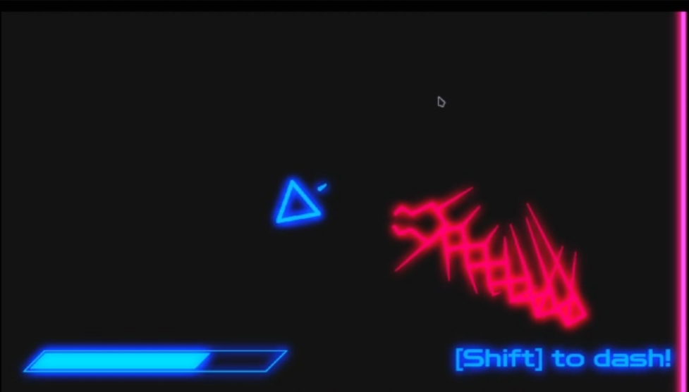

# Neonic

<!-- TABLE OF CONTENTS -->

  
Table of Contents

  <ol>
	<li><a href="#about-the-project">About The Project</a></li>
	<li><a href="#play">Play</a></li>
	<li><a href="#screenshots">Screenshots</a></li>
	<li><a href="#built-with">Built With</a></li>
	<li><a href="#roadmap">Roadmap</a></li>
	<li><a href="#license">License</a></li>
	<li><a href="#contact">Contact</a></li>
	<li><a href="#acknowledgments">Acknowledgments</a></li>
  </ol>

<!-- ABOUT THE PROJECT -->
## About The Project

> [!WARNING]
> EPILEPSY WARNING!! This project contains a black screen and bright colors that can be very fast. Player discretion is advised. Please be safe.

### Abstract
A neon game (apologies astigmatics) where you kill bugs and level up! Pick your favorite body and weapon from a headquarters screen!

## Motivation
I was inspired by the [Zero Sum Game](https://arandompsi.itch.io/zero-sum) makers, and wanted to give the aesthetic and game style a shot. I realize now that that isn't a very good way of going about things, and I would like to point all credit to them; their animations, sound design, level system, everything is much better than what I have done here. 

I must say that I am rather proud of the user interface, that's what I spent the most time on (if memory serves!). I wanted to try actually placing my UI inside a game and have it interact with systems for the first time (instead of just being standalone like my JUIOS project).

## What I learned
I tried my hardest to make everything seem polished; the movement, camera following, procedural legs, etc. I also tried to make robust systems to expand on further, like the weapon and body system, reusable UI components, tweening, and a lot more. In the end, for such a small scope, I went too far into polish and not enough into the actual gameplay; I don't think it's a very fun game, just cool to look at and rage at.

(<a href="#readme-top">back to top</a>)

<!-- Play -->

## Play 

If you'd like to build it yourself, I used Godot 4.5. I do have a pre-built web version available [here on my itch](https://pixelsaver.itch.io/neonic), but if you still insist on building this unoptimized mess, go ahead.

1. Install Godot 4.5
2. Download and unzip the code
3. Open the file with Godot project manager
4. Go to Project > Export, add whichever platform you're on (MacOS, Windows) and then click export.
5. You're good to go!

(<a href="#readme-top">back to top</a>)

<!-- SCREENSHOTS -->
## Screenshots
 

  
<strong>HQ</strong>

  

 

 
<strong>Fighting</strong>

 

   

<strong>Centipede</strong>

 

Gameplay!
https://github.com/user-attachments/assets/9c9c500d-9cf2-4326-9290-2c8969b68561

> [!TIP]
> Click `SHIFT` to dash! There's no implemented cooldown, just be careful about dashing into enemies!!

(<a href="#readme-top">back to top</a>)

## Built With
[Zed](https://zed.dev) - Main code editor

(<a href="#readme-top">back to top</a>)

<!-- ROADMAP -->
## Roadmap

 - [X] Enemies
  - [X] Bug
  - [X] Gunner
  - [X] Centipede
  - [X] Darth Lazer (shoots lazers across the room)
  - [ ] MORE TO COME
 - [X] Player
 - [X] Wave systems
 - [X] Multiple weapons
 - [X] Multiple players
 - [ ] Currency for winning
  - [ ] Shop to buy new weapons / bodies
- [ ] Endless mode
- [ ] More levels
- [ ] Different rooms
- [ ] Tutorial
- [ ] Settings
- [ ] Sounds
  - [ ] UI Sounds
  - [ ] Enemy Sounds

### Feedback
 - [X] Decrease intensity for play button when highlighted
 - [ ] Move NEONIC from start to home
 - [ ] Entity Entry boxes too close to showcase outline

(<a href="#readme-top">back to top</a>)

<!-- LICENSE -->
## License

Distributed under the MIT License. See `LICENSE` for more information.

(<a href="#readme-top">back to top</a>)

<!-- CONTACT -->
## Contact

Project Link: [https://github.com/PixelSaver/neonic](https://github.com/PixelSaver/neonic)

(<a href="#readme-top">back to top</a>)

<!-- ACKNOWLEDGMENTS -->
## Acknowledgments
- [Zero Sum Game](https://arandompsi.itch.io/zero-sum) - HEAVILY INSPIRED BY THESE DEVELOPERS!! GO CHECK THEM OUT!!
- [Just U and I](https://pixelsaver.itch.io/just-u-and-i) - My old shenanigans which led me to use them here! This is just the UI inspiration though
- [Zen Dots](https://github.com/googlefonts/zen-dots) - Fontface!! Copyright 2021 The Dots Project Authors licensed under [SIL Open Font License, Version 1.1](https://openfontlicense.org/open-font-license-official-text/)
---

I'm sorry to those who have astigmatism...

(<a href="#readme-top">back to top</a>)

